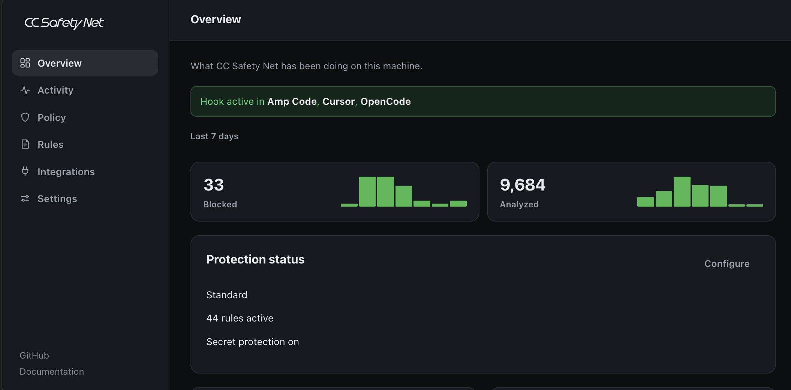
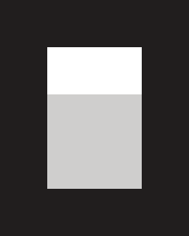

<h1>
  <picture>
    <source media="(prefers-color-scheme: dark)" srcset="./.github/assets/cc-safety-net-header-logo-dark.svg">
    <source media="(prefers-color-scheme: light)" srcset="./.github/assets/cc-safety-net-header-logo-light.svg">
    
  </picture>
</h1>

[](https://github.com/kenryu42/cc-safety-net/actions/workflows/ci.yml)
[](https://codecov.io/github/kenryu42/cc-safety-net)
[](https://github.com/kenryu42/cc-safety-net)
[](https://opensource.org/licenses/MIT)

<div align="center">

**English** · [简体中文](https://ccsafetynet.com/docs/zh-Hans) · [日本語](https://ccsafetynet.com/docs/ja)

[](./.github/assets/cc-safety-net-v2.png)

</div>

CC Safety Net is short for Coding CLI Safety Net. It is a PreToolUse hook that blocks destructive commands and access to secrets such as SSH keys and `.env` files before the tool call runs. It parses what a command does, so flag reordering, shell wrappers, and interpreter one-liners cannot bypass it.

> [!NOTE]
> **[Full documentation →](https://ccsafetynet.com/docs)** covers installation, configuration, reference material, guides, and the security model. This README is the short version.

## Why this exists

No major coding CLI deterministically blocks destructive git commands inside the workspace you handed it. `git reset --hard`, `git checkout -- .`, `git clean -f`, `git stash clear`, and `git push --force` all act on files the agent is already allowed to write, so a sandbox that scopes writes to the project directory sees nothing wrong. OpenAI's [Codex security docs](https://learn.chatgpt.com/docs/security) say commands under workspace-write "can still mutate state and perform destructive operations". An [independent analysis of Codex permissions](https://codex.danielvaughan.com) (2026-04-20) puts it directly: "No command-level semantic blocking: the system cannot prevent git reset --hard". Claude Code's [sandboxing docs](https://code.claude.com/docs/en/sandboxing) scope writes to the working directory, which is where your uncommitted work lives.

Three more reasons the layer is worth running:

- **A deterministic check under probabilistic ones.** Anthropic publishes a 17% false-negative rate for the Claude Code [auto-mode](https://www.anthropic.com/engineering/claude-code-auto-mode) classifier on real overeager actions and calls it "not a drop-in replacement for careful human review". Deny rules and hooks are the deterministic layer instead of a judgment call. Verified against Claude Code 2.1.251, a PreToolUse deny still fires in default, auto, and bypassPermissions modes (`tests/e2e-live/protection.test.ts`). That is a per-version result, not a standing guarantee, so the suite runs again on every release and host upgrade.
- **Secret protection with nothing to configure.** Claude Code's [sandboxing docs](https://code.claude.com/docs/en/sandboxing) state that the default read behavior "still allows reading credential files such as ~/.aws/credentials and ~/.ssh/", and that "There is no built-in credential deny list". The native equivalents in other CLIs are opt-in config you write per CLI. CC Safety Net blocks content access to those paths and to project `.env` files on install, across shell commands and the read, edit, write, and search tools.
- **One policy and one audit trail across 13 CLIs.** Five vendors ship five incompatible permission mechanisms and no decision log you can read afterwards.

Layers below this one have failed in the field. [Why not just use a sandbox?](#why-not-just-use-a-sandbox) covers the sandbox and allowlist CVEs, and Adversa's [incident tracker](https://adversa.ai/blog/ai-coding-agent-incidents) records nine agent destruction cases from 2025 and 2026, with guardrails enabled in about half of them.

The founding case still stands. It is just no longer the frontier. An agent [wiped hours of work](https://www.reddit.com/r/ClaudeAI/comments/1pgxckk/claude_cli_deleted_my_entire_home_directory_wiped/) with one `rm -rf ~/`, and instructions did not stop it. Claude Code now ships a deterministic circuit breaker for critical paths like that one, which is the right fix and the reason it is no longer our headline. The git commands above have no such breaker. Rules in `CLAUDE.md` or `AGENTS.md` can guide an agent, but they cannot enforce a technical limit. See [What is CC Safety Net](https://ccsafetynet.com/docs/introduction) for the full background.

## Quick start

You need Node.js 18 or higher.

Run the interactive selector to install CC Safety Net into one or more installed coding CLIs:

```bash
npx -y cc-safety-net@latest install
```

To update every installed integration:

```bash
npx -y cc-safety-net@latest update
```

Keep the `@latest` qualifier; a bare `cc-safety-net` spec can run an older cached copy from the npx cache. `npx -y cc-safety-net uninstall` removes integrations interactively, and `npm install -g cc-safety-net` gives you `ccsn`, a shorter alias for the same commands.

## Supported coding CLIs

CC Safety Net supports the coding agent CLIs below on Windows, macOS, and Linux. Automated tests cover the analyzer and some Windows integrations. Other hosts have best-effort Windows support that has not been tested. Amp documents macOS, Linux, and WSL, but not native Windows.

<table align="center">
  <tr>
    <td align="center"><a href="https://ccsafetynet.com/docs/installation#amp-code-installation"><picture><source media="(prefers-color-scheme: dark)" srcset="./.github/assets/amp-dark.svg"></picture><br>Amp Code</a></td>
    <td align="center"><a href="https://ccsafetynet.com/docs/installation#antigravity-cli-installation"><br>Antigravity CLI</a></td>
    <td align="center"><a href="https://ccsafetynet.com/docs/installation#claude-code-installation"><br>Claude Code</a></td>
    <td align="center"><a href="https://ccsafetynet.com/docs/installation#codex-installation"><br>Codex</a></td>
    <td align="center"><a href="https://ccsafetynet.com/docs/installation#cursor-installation"><picture><source media="(prefers-color-scheme: dark)" srcset="./.github/assets/cursor-dark.svg"></picture><br>Cursor</a></td>
  </tr>
  <tr>
    <td align="center"><a href="https://ccsafetynet.com/docs/installation#gemini-cli-installation"><br>Gemini CLI</a></td>
    <td align="center"><a href="https://ccsafetynet.com/docs/installation#github-copilot-cli-installation"><picture><source media="(prefers-color-scheme: dark)" srcset="./.github/assets/copilot-cli-dark.svg"></picture><br>GitHub Copilot CLI</a></td>
    <td align="center"><a href="https://ccsafetynet.com/docs/installation#grok-build-installation"><picture><source media="(prefers-color-scheme: dark)" srcset="./.github/assets/grok-build-dark.svg"></picture><br>Grok Build</a></td>
    <td align="center"><a href="https://ccsafetynet.com/docs/installation#hermes-agent-installation"><br>Hermes Agent</a></td>
    <td align="center"><a href="https://ccsafetynet.com/docs/installation#kimi-code-installation"><br>Kimi Code</a></td>
  </tr>
  <tr>
    <td align="center"><a href="https://ccsafetynet.com/docs/installation#openclaw-installation"><br>OpenClaw</a></td>
    <td align="center"><a href="https://ccsafetynet.com/docs/installation#opencode-installation"><picture><source media="(prefers-color-scheme: dark)" srcset="./.github/assets/opencode-dark.svg"></picture><br>OpenCode</a></td>
    <td align="center"><a href="https://ccsafetynet.com/docs/installation#pi-installation"><picture><source media="(prefers-color-scheme: dark)" srcset="./.github/assets/pi-dark.svg"></picture><br>Pi</a></td>
  </tr>
</table>

## What it does

| Capability | What it catches |
|---|---|
| **Semantic command analysis** | Detects the intent of `rm -rf` on destructive targets, `git reset --hard`, `git checkout --`, `git push --force`, `git stash clear`, `git clean -f`, unsafe `find -delete`, `dd`, `mkfs`, and `shred`. It allows `git checkout -b feature` but blocks `git checkout -- file`. |
| **Shell wrapper detection** | Finds destructive commands inside `bash -c`, `sh -c`, and similar wrappers. It analyzes nested wrappers up to 10 levels deep. |
| **Interpreter one-liners** | Finds destructive code in `python -c`, `node -e`, `ruby -e`, and `perl -e` one-liners such as `os.system("rm -rf /")`. |
| **Fail-closed by default** | Blocks malformed hook input and, in strict mode, commands it cannot parse. Invalid configuration never blocks. CC Safety Net drops an unverifiable rule source and uses protective defaults when it cannot read `policy.json`. It reports these states in block messages, `doctor`, the status line, and the GUI. |
| **Secret protection** | Blocks content access to SSH keys, `.env` files, `~/.aws`, Kubernetes, Docker, and gcloud configuration, and coding-CLI credential stores. The rules apply to shell commands and read, edit, write, and search tools. |
| **Custom rules via rulebooks** | Lets you add blocking rules at user or project scope. Rulebooks are live JSON files: local ones are authored in place, and rulebooks fetched from GitHub are validated and vendored into your own configuration, updating only when you run `rule update`. |
| **Audit logging** | Writes allowed and blocked command decisions to local per-project JSONL, redacts secrets, and keeps records for 30 days by default. Browse them with `npx cc-safety-net logs`, or review them in the Activity view of `npx cc-safety-net gui`. |

Full rule catalogs: [Blocked Commands](https://ccsafetynet.com/docs/reference/blocked-commands) · [Allowed Commands](https://ccsafetynet.com/docs/reference/allowed-commands) · [Secret Protection](https://ccsafetynet.com/docs/reference/secret-protection).

## Official rulebooks for AWS, Terraform, gcloud, and Azure

The [cc-safety-net/rulebooks](https://github.com/cc-safety-net/rulebooks) repository publishes curated rulebooks that block recognizable destructive infrastructure CLI operations: `terraform destroy` and `terraform state rm`, `aws s3 rm` and `aws ec2 terminate-instances`, `gcloud projects delete` and `gcloud storage rm`, `az group delete` and `az keyvault purge`, and more. Safe previews such as `--dryrun` and `-dry-run` stay allowed. Install a selection with one command:

```bash
npx -y cc-safety-net rule add --only terraform aws --global
```

Rulebooks are JSON data: never executed, only adding denials, unable to weaken built-in protections. Installing vendors the files into your own configuration; nothing updates in the background. See [Official Rulebooks](https://ccsafetynet.com/docs/configuration/rulebooks).

## Team setup

Members who install CC Safety Net once per machine are protected in every repository at the standard preset, so the minimum team setup is automating that install in your project's existing bootstrap step, such as an npm `postinstall` script. To standardize more than the defaults, a team lead commits a project policy and project-scoped rulebooks under `.cc-safety-net/`, and every clone picks them up with no member action. Policy changes stay human-approved: `policy apply` requires a terminal confirmation and refuses agent invocations, and any field a project policy relaxes below a member's own policy is reported line by line in `status`, `doctor`, and the GUI. See [Team Setup](https://ccsafetynet.com/docs/guides/team-setup).

## Cloud environments

A cloud agent session runs on a machine nobody signs into, and it clones your repository at a real branch and pushes back to your real remote. Anthropic's [Claude Code on the web](https://code.claude.com/docs/en/claude-code-on-the-web) docs say cloud environments keep credentials outside the sandbox and attach API keys to requests "after they leave the session", which stops the session from reading a key but not from using it, so the [official rulebooks](#official-rulebooks-for-aws-terraform-gcloud-and-azure) apply there more than anywhere. Platform guardrails are per-version too: a scheduled cloud task pushed straight to `main` with unrestricted branch pushes turned off ([anthropics/claude-code#44949](https://github.com/anthropics/claude-code/issues/44949)). Committed configuration is what reaches those sessions. Cloud sessions read settings files and `.cc-safety-net/` out of the repository, Amp personal plugins follow the account into Orb threads, and a devcontainer or Dockerfile installs at build time, since installing protection needs no terminal. See [Cloud Environments](https://ccsafetynet.com/docs/guides/cloud-environments).

## Why not just use a sandbox?

A sandbox decides where a process may write. It does not decide what the process may do inside that area. Claude Code's [sandboxing docs](https://code.claude.com/docs/en/sandboxing) scope writes to the working directory by default, so `git reset --hard`, `git push --force`, and `rm -rf .` on your project all land on allowed paths, and the operating system sees permitted writes.

Reads are wider than most people assume. The same docs say of the default read behavior that "There is no built-in credential deny list", and name `~/.aws/credentials` and `~/.ssh/` as files it still allows reading. CC Safety Net blocks content access to those paths with no configuration.

Sandboxes and allowlists also break. CVE-2026-25725 escaped Claude Code's bubblewrap sandbox through `settings.json`, and CVE-2026-22708 bypassed Cursor's command allowlist. Run both layers. See [vs Sandboxing](https://ccsafetynet.com/docs/guides/vs-sandboxing).

## Safety presets

Set a session safety preset with the GUI `npx cc-safety-net gui` then navigate to the policy tab:

| Preset | Effect |
|---|---|
| Standard | Blocks recognizable destructive Git and filesystem commands. Allows metadata-only checks of built-in sensitive paths while continuing to block content access. Recommended for normal coding. |
| Strict | Standard, plus blocks dynamic or unparseable commands the analyzer cannot verify safely and metadata-only discovery of built-in sensitive paths. Occasional false positives on advanced shell. |
| Paranoid | Strict, plus blocks `rm -rf` inside your project and interpreter one-liners. Expect friction; for untrusted agents or high-stakes repos. |

## Diagnostics and tracing

```bash
# Summarize what is being enforced right now
npx cc-safety-net status
# Verify your installation and run a self-test
npx cc-safety-net doctor
# Trace how a command is analyzed step-by-step
npx cc-safety-net explain "git reset --hard"
# Browse recorded denials from the audit trail (add --all to include allowed commands)
npx cc-safety-net logs
# Review what was blocked and edit your policy in a local web GUI
npx cc-safety-net gui
```

`doctor`, `explain`, and `logs` support `--json` for machine-readable output. The audit trail stays on your machine. It records command decisions, but it does not record command output or prompts.

Details: [CLI Commands](https://ccsafetynet.com/docs/reference/cli-commands) · [Explain Trace](https://ccsafetynet.com/docs/reference/explain-trace) · [Audit Log](https://ccsafetynet.com/docs/reference/audit-log) · [Dashboard](https://ccsafetynet.com/docs/guides/dashboard) · [Configuration Recovery](https://ccsafetynet.com/docs/configuration/recovery).

## The /cc-safety-net skill

The plugin ships a skill that turns your coding agent into a CC Safety Net operator. It never triggers on its own; you invoke it by typing `/cc-safety-net` in the agent (Claude Code lists it under its plugin namespace as `cc-safety-net:cc-safety-net`; Pi and OpenCode register it as a built-in `/cc-safety-net` command).

Reach for it when:

- A command was just refused with `BLOCKED by CC Safety Net` and you want the step-by-step reason.
- A block looks wrong and you want it triaged: reproduce the decision, fix the responsible custom rule, or report a built-in false positive.
- You want custom blocking rules written, edited, or migrated for you.
- You want CC Safety Net installed into, updated in, or removed from another agent CLI.
- A rule you added does not fire, or you want to confirm protection is active.

Anything you type after the command becomes the request, e.g. `/cc-safety-net why was my last git command blocked` or `/cc-safety-net block terraform destroy in this project`.

## Library API

Node.js hosts that need an in-process allow or deny decision can call the command-check
function directly instead of installing an agent integration:

```bash
npm install cc-safety-net
```

```ts
import { checkCommand } from 'cc-safety-net/api';

function commandIsAllowed(command: string, cwd: string): boolean {
  try {
    const result = checkCommand({ command, cwd });
    if (result.kind === 'allow') return true;
    console.error(result.reason);
    return false;
  } catch (error) {
    console.error('CC Safety Net could not check the command', error);
    return false;
  }
}

if (commandIsAllowed('git status', process.cwd())) {
  // The host can now decide how to run the command.
}
```

Usage rules:

- `cwd` is required and must be an absolute directory path. It anchors relative command
  targets and selects the project policy.
- A `deny` result means the host must not execute the command. **If `checkCommand` throws,
  do not execute the command either.**

### Stability contract

These hold across minor versions, so a host can build on them:

- The input shape `{ command, cwd }`, with `cwd` an absolute directory path, and the two
  result kinds, `allow` and `deny` with a `reason` string and an optional `ruleId`.
- A `deny` means do not execute the command, and a throw means the same. A throw is never
  an allow.
- `cwd` anchors policy resolution. Relative command targets and the project's
  `.cc-safety-net/` configuration resolve against the `cwd` you pass, never `process.cwd()`.
- The API path writes no audit record and makes no network request. One call reads policy
  files and `CC_SAFETY_NET_*` environment settings, nothing else.

The rule catalog is free to change in any minor version. Which commands get denied grows
with each release, and `reason` wording changes with it. Branch on `kind`, and keep
`reason` and `ruleId` for humans and logs rather than comparing against them.

A worked host example is in [Embedding](https://ccsafetynet.com/docs/guides/embedding).

## Limitations

CC Safety Net denies a tool call before it runs. It does not enforce filesystem permissions, inspect network egress, or contain a process. Two v2 limits matter. First, the policy and sensitive-path command extractors remain mainly POSIX-oriented. Native PowerShell path expressions such as `Get-Content $HOME\.ssh\id_rsa` can evade static path extraction. Second, policy-file protection is a best-effort exact-path guard. It does not emulate commands. Use operating-system permissions, a sandbox, or equivalent runtime controls when you need complete protection.

Codex has one integration-specific limit. Its unified exec path is the default on macOS and Linux. It sends a hook payload when a command starts a session, but it sends none for `write_stdin`. CC Safety Net can inspect and audit the command that opens the session. It cannot inspect or audit text that the model types into the running session. Codex emits no event for that call, so an adapter change cannot close this gap.

[SECURITY.md](SECURITY.md) contains the full residual-risk registry. [Known Limitations](https://ccsafetynet.com/docs/guides/known-limitations) explains what those risks mean in practice.

## Upgrading from an older version

Run the `update` command from [Quick start](#quick-start) to upgrade every installed integration to the current release.

If you installed rulebooks from GitHub on version 2.2 or earlier, run `npx -y cc-safety-net rule sync` once per scope (add `--global` for user-scope sources) after upgrading. Rulebooks are now live vendored files instead of lock-and-cache state; the command migrates each cached rulebook into its live location and removes the leftovers. Until then, those GitHub-sourced rules are inactive and `status` and `doctor` report the degraded sources.

> [!WARNING]
> If you defined custom rules in a legacy inline config such as `.safety-net.json` or `~/.cc-safety-net/config.json`, CC Safety Net no longer loads those files at runtime. Their rules enforce nothing. Normal use does not show this failure because the commands now run. Run `npx -y cc-safety-net rule migrate` to convert the rules to the rulebook layout. Then run `npx -y cc-safety-net doctor` and confirm that the runtime is `ready`. See the [migration guide](https://ccsafetynet.com/docs/configuration/custom-rules#migrate-legacy-configuration).

## Full documentation

The **[ccsafetynet.com/docs](https://ccsafetynet.com/docs)** site contains the full documentation:

| Area | Pages |
|---|---|
| Get started | [Introduction](https://ccsafetynet.com/docs/introduction) · [Installation](https://ccsafetynet.com/docs/installation) · [Quickstart](https://ccsafetynet.com/docs/quickstart) · [Team Setup](https://ccsafetynet.com/docs/guides/team-setup) · [Cloud Environments](https://ccsafetynet.com/docs/guides/cloud-environments) · [How It Works](https://ccsafetynet.com/docs/guides/how-it-works) · [Dashboard](https://ccsafetynet.com/docs/guides/dashboard) |
| Configuration | [Modes](https://ccsafetynet.com/docs/configuration/modes) · [Policy](https://ccsafetynet.com/docs/configuration/policy) · [Environment](https://ccsafetynet.com/docs/configuration/environment) · [Custom Rules](https://ccsafetynet.com/docs/configuration/custom-rules) · [Official Rulebooks](https://ccsafetynet.com/docs/configuration/rulebooks) · [Status Line](https://ccsafetynet.com/docs/configuration/status-line) · [Configuration Recovery](https://ccsafetynet.com/docs/configuration/recovery) |
| Reference | [Blocked Commands](https://ccsafetynet.com/docs/reference/blocked-commands) · [Allowed Commands](https://ccsafetynet.com/docs/reference/allowed-commands) · [Secret Protection](https://ccsafetynet.com/docs/reference/secret-protection) · [Audit Log](https://ccsafetynet.com/docs/reference/audit-log) · [CLI Commands](https://ccsafetynet.com/docs/reference/cli-commands) · [Explain Trace](https://ccsafetynet.com/docs/reference/explain-trace) · [Glossary](https://ccsafetynet.com/docs/reference/glossary) |
| Guides | [Architecture](https://ccsafetynet.com/docs/guides/architecture) · [Analysis Engine](https://ccsafetynet.com/docs/guides/analysis-engine) · [Design Principles](https://ccsafetynet.com/docs/guides/design-principles) · [Security Model](https://ccsafetynet.com/docs/guides/security-model) · [vs Sandboxing](https://ccsafetynet.com/docs/guides/vs-sandboxing) · [Integration Architecture](https://ccsafetynet.com/docs/guides/integration-architecture) · [Embedding](https://ccsafetynet.com/docs/guides/embedding) · [Known Limitations](https://ccsafetynet.com/docs/guides/known-limitations) · [Troubleshooting](https://ccsafetynet.com/docs/guides/troubleshooting) |
| Project | [Contributing](https://ccsafetynet.com/docs/contributing) · [Security Policy](https://ccsafetynet.com/docs/security) |

## Development

See [CONTRIBUTING.md](CONTRIBUTING.md) to contribute to the project.

## License

MIT
